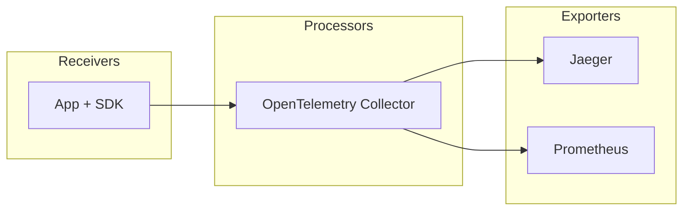

# flask-otlp-example

Opentelemetry flask example +instrumentation. Based on: <https://opentelemetry.io/docs/languages/python/getting-started/>

# Run locally

```shell
docker-compose up && curl localhost:8080/rolldice
```

Access Jaeger UI to see traces: http://localhost:16686/search

Access prometheus UI to see metrics: http://localhost:9090

## Diagram

