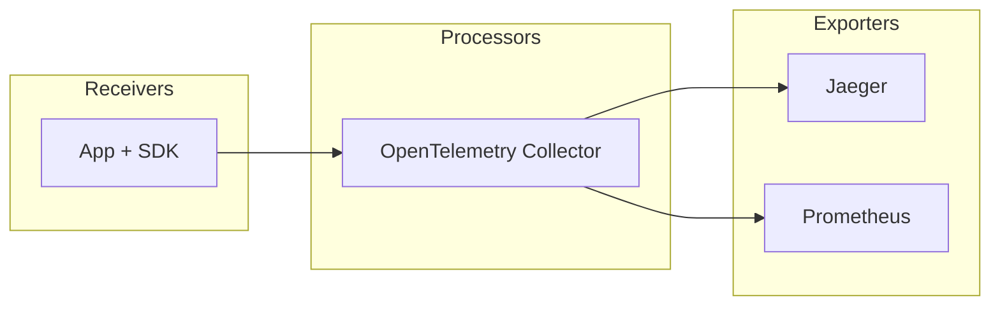

# flask-otlp-example

Image for: <https://opentelemetry.io/docs/languages/python/getting-started/>

```mermaid
graph LR
    A[App + SDK] --> B[OpenTelemetry Collector]
    B --> C[Jaeger]
    B --> D[Prometheus]
    subgraph Receivers
        A
    end
    subgraph Processors
        B
    end
    subgraph Exporters
        C
        D
    end
```
